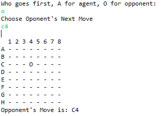

# 4-in-a-row

Play a game between user and AI.

## Getting Started
1. Choose who to play first. O for user, A for AI

2. If AI is set to play first, it's default first move is D4.

3. First one to connect 4 in a row, diagonally, vertically, or horizontally wins.
Also, keep records of every move.

